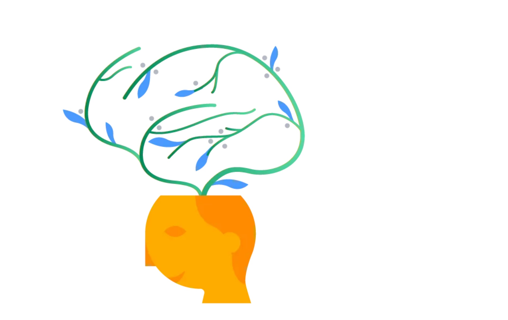

# reading-notes

## **How you can benefit from a growth mindset** 😊

### What is a growth mindset? 🛡️

####  *A growth mindset believes that one’s fundamental abilities can be developed through perseverance and effort; intelligence and talent are simply good starting points. A growth mindset is synonymous with a love of learning*

##### ***Here’s a simple illustration highlighting the differences between a fixed and a growth mindset:***

