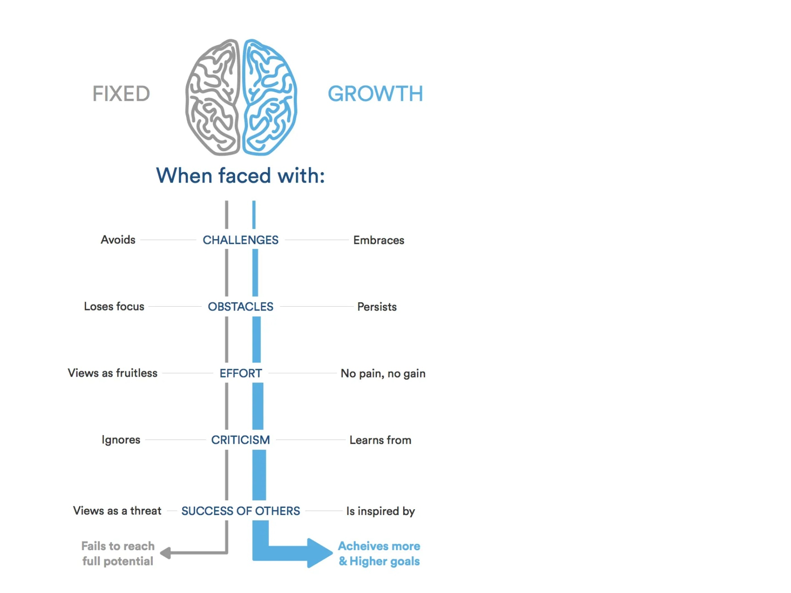

#  `Lab01`

 ## About me

Hello Dear Gentlemen

Abdallah Hamoury, I am 31 years old. I am a specialist in marketing. I have a master’s degree in marketing and two university degrees in business administration and marketing I spend my time reading, I love to learn new things, and I have a passion for everything electronic Leave the world a beautiful place 😜

## **How you can benefit from a growth mindset** 😊

### What is a growth mindset? 🛡️

####  *A growth mindset believes that one’s fundamental abilities can be developed through perseverance and effort; intelligence and talent are simply good starting points. A growth mindset is synonymous with a love of learning*

##### ***Here’s a simple illustration highlighting the differences between a fixed and a growth mindset:***

###### Perseverance, gumption traps, and maintaining a growth mindset

1. Challenges
2. Obstacles
3. Effort

### **how i can keep yourself in a growth mindset**

* `View challenges as opportunities`
* `Try different learning tactics`
* `Follow the research on brain plasticity`

[more details](https://www.atlassian.com/blog/inside-atlassian/growth-mindset)

