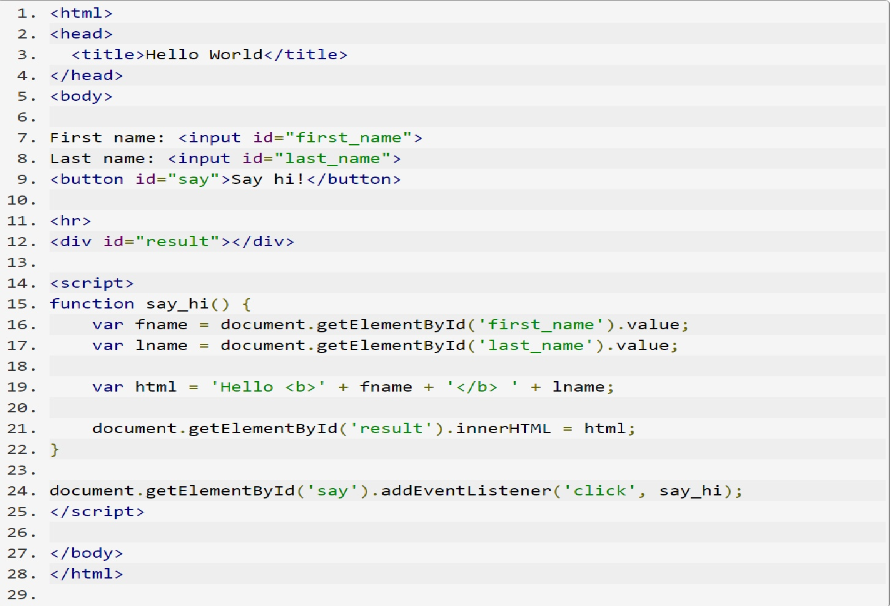
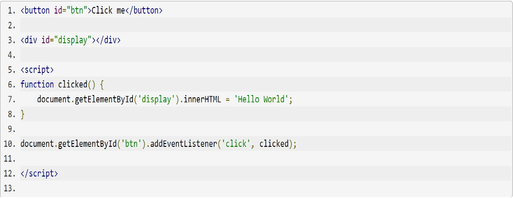

## JavaScript

> JavaScript (JS) is a lightweight, interpreted, or just-in-time compiled programming language with first-class functions. While it is most well-known as the scripting language for Web pages, many non-browser environments also use it, such as Node.js, Apache CouchDB and Adobe Acrobat. JavaScript is a prototype-based, multi-paradigm, single-threaded, dynamic language, supporting object-oriented, imperative, and declarative (e.g. functional programming) styles.

 > ***Do not confuse JavaScript with the Java programming language. Both "Java" and "JavaScript" are trademarks or registered trademarks of Oracle in the U.S. and other countries. However, the two programming languages have very different syntax, semantic, and use.***

 * Standard objects

 Get to know standard built-in objects Array, Boolean, Date, Error, Function, JSON, Math, Number, Object, RegExp, String, Map, Set, WeakMap, WeakSet, and others.

 * Expressions and operators
 Learn more about the behavior of JavaScript's operators instanceof, typeof, new, this, the operator precedence, and more.
Statements and declarations

* Functions
Learn how to work with JavaScript's functions to develop your applications.[More](https://developer.mozilla.org/en-US/docs/Web/JavaScript/Reference/Functions)

### Example

## Reference

* Standard objects

Get to know standard built-in objects Array, Boolean, Date, Error, Function, JSON, Math, Number, Object, RegExp, String, Map, Set, WeakMap, WeakSet, and others.

*Expressions and operators

Learn more about the behavior of JavaScript's operators instanceof, typeof, new, this, the operator precedence, and more.

* Statements and declarations

Learn how do-while, for-in, for-of, try-catch, let, var, const, if-else, switch, and more JavaScript statements and keywords work. 

* Functions

Learn how to work with JavaScript's functions to develop your applications.

----------------------------------------

In JavaScript we can attach various, so called "event listeners" to every DOM element and we can even specify to which event should the specific listener react to.

or this we can use the **addEventListener** method of a DOM element, that will get two parameters. The first one is the name of the event, such as click or keyup, or change. The second one is a function. (I might need to explain how can you pass a function as a parameter to another function.)

Here is the full expression:

>document.getElementById('btn').addEventListener('click', clicked);

This means that when the browser detects a 'click' on the HTML element with the id 'btn', then it will execute the function called 'clicked'.

What does the 'clicked' function do? 

It changes the DOM (the HTML) by inserting the text 'Hello World' in the element with the id 'display'. This operation was explained in the article about changing the DOM.

